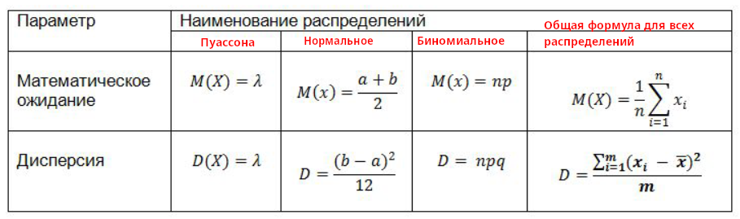

### [Урок 4. Непрерывная случайная величина](https://gb.ru/lessons/447656)

_Функция плотности распределения вероятностей для нормального распределения выглядит так:_

$f(x)=\frac{1}{\sigma \sqrt{2 \pi}} \; e^{-\frac{(x-a)^2}{2\sigma ^2}}$

Здесь $a$ – это математическое ожидание,

$\sigma$ - среднее квадратичное отклонение,

$\sigma ^2$ - дисперсия.

Дисперсия (от лат. dispersio — рассеяние), в математической статистике и теории вероятностей, наиболее употребительная мера рассеивания, т. е. отклонения от среднего.

**Правило трех сигм:**

    • от −σ до +σ расположено около 68% наблюдений;
    • от −2σ до +2σ расположено около  95.4% наблюдений;
    • от −3σ до +3σ расположено около  99.72% наблюдений

Чтобы найти долю ниже любого значения по оси х, мы можем воспользоваться таблицей z-значений или ее еще называют таблицей накопленного нормального распределения.

$z=\frac{x-\mu}{\sigma}$

Т.е. z показывает, а в скольких сигмах лежит то или иное значение СВ от среднего арифметического.

Чтобы найти математическое ожидание и дисперсию равномерно распределенной величины используются формулы:

$M(x)=\frac{a+b}{2}$

$D=\frac{(b-a)^2}{12}$

#### Задание 1

**Веса изделий следуют нормальному распределению с дисперсией 9 и средним
арифметическим 50. Веса ниже 45 г считаются браком. Какая доля изделий бракованная?**

> $z=\frac{X-\mu}{\sigma}$, где

$\sigma=\sqrt{9}=3$ (среднее квадратичное отклонение)

$\mu=$ 50 (среднее арифметическое)

> $z=\frac{45-50}{3} ≈ -1.67$; По таблице $z(-1.67) = 0.0475 = 4.75$%

**Дана генеральная совокупности из задачи 1. Найдите долю изделий:**

**1. Весом выше 56 г**

> $z=\frac{56-50}{3} = 2$; По таблице $z(2) = 0.9772$

> доля изделей с весом выше 56 г $= 1-0.9772 = 2,28$%

**2. Весом меньше 55 г**

> $z=\frac{55-50}{3} = 1.67$; По таблице $z(1.67) = 0.9525$

> Ответ $= 95,25$%

**3. Весом не больше 50 г**

> Ответ $=50$% (так как 50 - среднее арифметическое)

**4. Весом не больше 55 г, но не меньше 45 г**

> $z=\frac{55-50}{3} = 1.67$; По таблице $z(1.67) = 0.9525$

> $z=\frac{45-50}{3} = -1.67$; По таблице $z(-1.67) = 0.0475$

> Ответ $=z(1.67)-z(-1.67) = 0.905$

**Дана та же генеральная совокупность из задачи №1 со средним арифметическим 50 и дисперсией 9. В скольких стандартных отклонениях лежит вес 56 г?**

> $z=\frac{56-50}{3} = 2$

#### Задание 2

**Найдите математическое ожидание случайной величины X, равномерно распределенной на отрезке (-3, 3]**

> $M(x)=\frac{a+b}{2}; \quad M(x) = \frac{-3+3}{2} = 0$

#### Задание 3

**Найдите среднее квадратичное отклонение случайной величины X, равномерно
распределенной на отрезке [-2, 7]**

> $D=\frac{(b-a)^2}{12}; \quad D= \frac{(7+2)^2}{12} = \frac{81}{12}$

> $\sigma=\sqrt{D}; \quad \sigma = \frac{9}{\sqrt{12}}=\frac{9\sqrt{3}}{6}=\frac{3\sqrt{3}}{2}$

